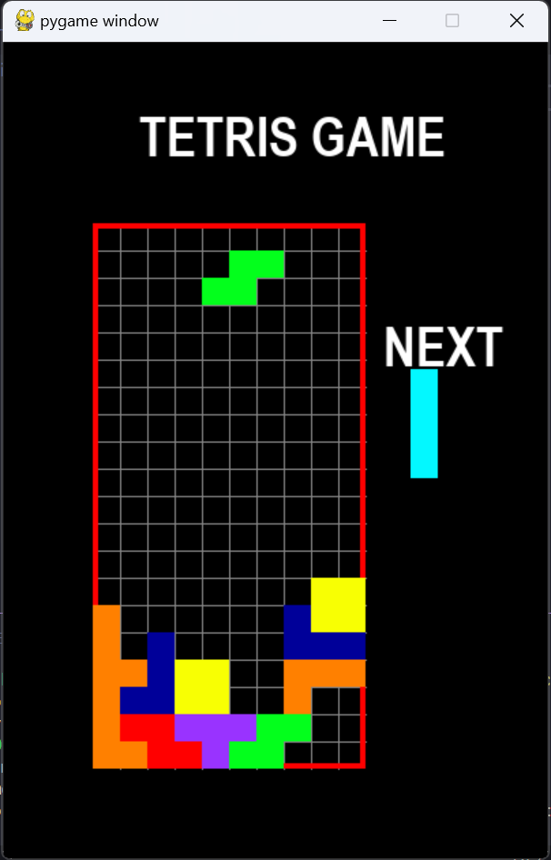
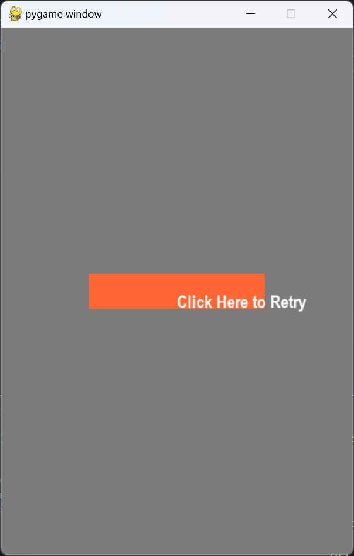

## Good Old Tetris

- first you need to add requirement package by ruining this line
```bash
pip install -r requirements.txt
```

- now you can start the game using this line
```bash
py main.py
```

using your keyboard to play the game


retry if you lose
